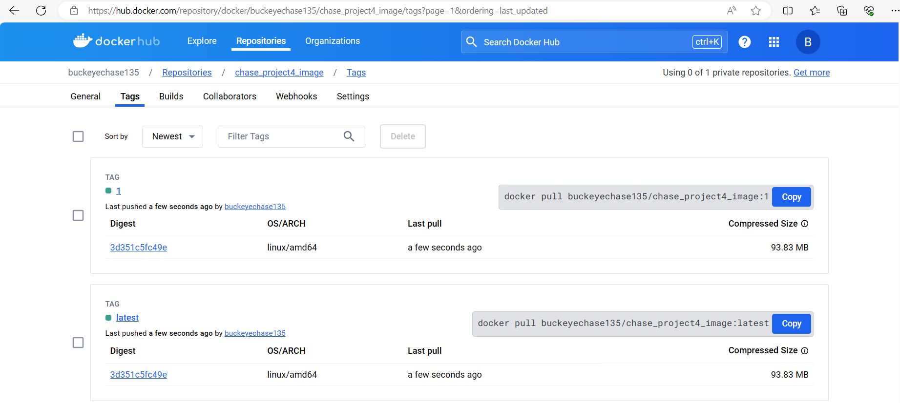
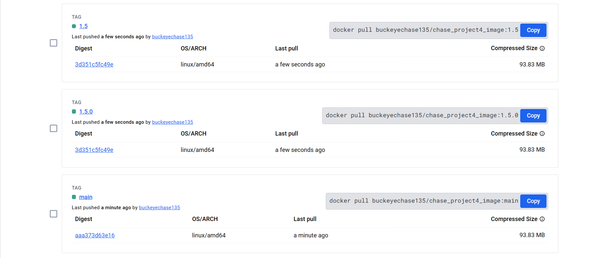
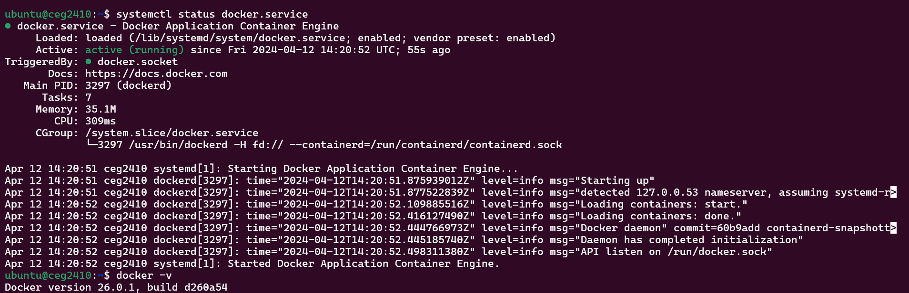
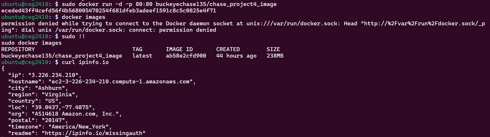
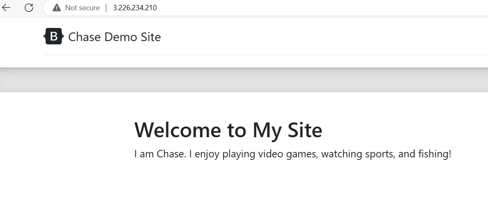
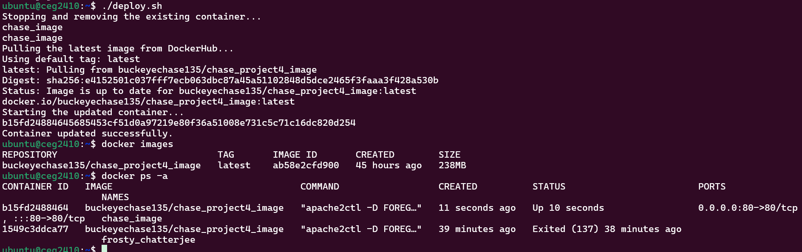

# Project 5: Introduction to the Design of Information Technology Systems - CEG3120
   
## Name: Chase Ennis       

### Part 1: Semantic Versioning

1. Project Overview:
   * I am being asked to modify my workflow (`main.yml`) from project 4 to automatically build and push the image to dockerhub when I push the tag to github.
2. Semantic Versioning Format:
   * `Major`.`Minor`.`Patch`
   * For this project, I focus on `{{major}}`, `{{major}}.{{minor}}`, `latest` and the way my workflow is set up also includes `main` and `{{major}}.{{minor}}` with whatever else comes after it (which would be the full semantic version as seen below in the image with `1.5.0`) 
   * [Semantic Versioning](https://semver.org/)
3. Generating a Tag:
   * `git tag -a v1.0.0 -m "Version 1.0.0"`
     * `-a`: creates annnoted tag
   * `git push origin --tags` or `git push origin v1.0.0`
4. Deleting a Tag:
   * `git tag -d v1.0.0`
   * ` git push --delete origin v1.0.0` 
5. Updated `main.yml` file:

```
        name: Build and Push Docker chase_project4_image
        
        on:
          push:
            branches:
              - 'main'
            tags:
              - 'v*.*'
          pull_request:
            branches:
              - 'main'
        
        jobs:
          docker:
            runs-on: ubuntu-latest
            steps:
              -
                name: Checkout
                uses: actions/checkout@v2
        
              -
                name: Docker meta
                id: meta
                uses: docker/metadata-action@v5
                with:
                  images: |
                    buckeyechase135/chase_project4_image
                  tags: |
                    type=ref,event=branch
                    type=ref,event=pr
                    type=semver,pattern={{version}}
                    type=semver,pattern={{major}}.{{minor}}
                    type=semver,pattern={{major}}
        
              -
                name: Login to DockerHub
                if: github.event_name != 'pull_request'
                uses: docker/login-action@v3
                with:
                  username: ${{ secrets.DOCKER_USERNAME }}
                  password: ${{ secrets.DOCKER_PASSWORD }}
        
              -
                name: Build and push
                uses: docker/build-push-action@v5
                with:
                  context: .
                  push: ${{ github.event_name != 'pull_request' }}
                  tags: ${{ steps.meta.outputs.tags }}
                  labels: ${{ steps.meta.outputs.labels }}
```
6. Explanation:
   * `name`: Name of Action Workflow
   * `on`: specifies the events that trigger the workflow
      * for this the tag must follow this specific pattern: `'v*.*'`
   * `jobs`: specifies the jobs that will happen while the workflow is executed
   * `runs-on`: specifies the runner needed for the job
      * In this case it is the latest version of Ubuntu (`ubuntu-latest`)
   * `steps`: these are the actions that will be completed. This Workflow has 4
       1. `actions/checkout@v2`: checkout action that uses the code found inside the repository folder
       2. `docker/metadata-action@v5`: metadata action that gathers data about the image. For this use, it gathers the data about the tags
       3. `docker/login-action@v3`: login action which authenticates my account to DockerHub using the Repository Secrets
       4. `docker/build-push-action@v5`: build and push actions which build and push the image
           * executes when I `push` to `GitHub` not when I `pull` from `GitHub` as seen in this line: `push: ${{ github.event_name != 'pull_request' }}`
           * references `tags` and `labels` from the `metadata` action
7. [Updated DockerHub Repository](https://hub.docker.com/repository/docker/buckeyechase135/chase_project4_image/tags?page=1&ordering=last_updated)
8. Proof:
    * 
    * 
      
### Part 2: Deployment

1. Installing `docker`:
   * `sudo apt update`
   * `sudo apt install -y apt-transport-https ca-certificates curl software-properties-common`
   * `curl -fsSL https://download.docker.com/linux/ubuntu/gpg | sudo apt-key add -`
   * `sudo add-apt-repository "deb [arch=amd64] https://download.docker.com/linux/ubuntu $(lsb_release -cs) stable"`
   * `sudo apt update`
   * `sudo apt install docker-ce`
   * `sudo systemctl start docker`
   * `sudo systemctl enable docker`
   * `sudo usermod -aG docker $USER` (allows docker commands to be run without `root`)
   * 
2. Pull and Run a container from DockerHub image
   * Pull Container: `docker pull buckeyechase135/chase_project4_image:latest`
   * Run Container: `sudo docker run -d -p 80:80 buckeyechase135/chase_project4_image`
   * I used my Instance from another class (`3.226.234.210`)
   * Proof
      * 
      * 
3. Create Script that pulls a new image from DockerHub and restart the container
   * Script is called `deploy.sh` and can be found in the `deployment` directory
   * Please not for mine to work I gave it the name `chase_image` which I have been using the entire time: `sudo docker run -d -p 8080:80 --name chase_image buckeyechase135/chase_project4_image`
   * My script uses variables
       * `IMAGE_NAME="buckeyechase135/chase_project4_image"`
       * `CONTAINER_NAME="chase_image"`
   * Script stops and removes existing container
       * `docker stop $CONTAINER_NAME`
       * `docker rm $CONTAINER_NAME`
   * Pulls the latest image
       * `docker pull $IMAGE_NAME`
   * Runs new container
       * `docker run -d -p 80:80 --name $CONTAINER_NAME --restart always $IMAGE_NAME`
   * 


Container restart script

Justification & description of what it does
Where it should be on the instance (if someone were to use your setup)
Setting up a webhook on the instance

How to install adnanh's webhook to the instance
How to start the webhook
since our instance's reboot, we need to handle this
webhook task definition file

Description of what it does
Where it should be on the instance (if someone were to use your setup)
How to configure GitHub OR DockerHub to message the listener

Provide proof that the CI & CD workflow work. This means:

starting with a commit that is a change, taging the commit, pushing the tag
Showing your GitHub workflow returning a message of success.
Showing DockerHub has freshly pushed images.
Showing the instance that you are deploying to has the container updated.
Proof can be provided by either demonstrating to me in person OR by creating a video of the process. If you go the video route and your file is too large for GitHub, submit it to the "Project 5 - Proof of Flow" Dropbox on Pilot

### Part 3: Diagramming
