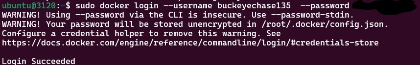
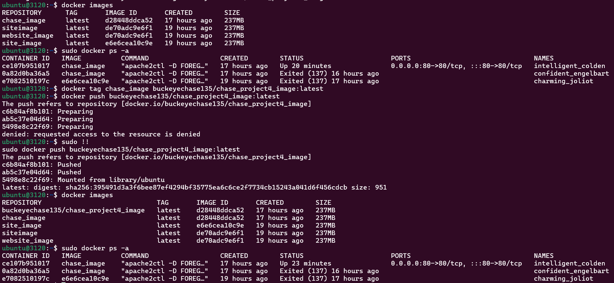
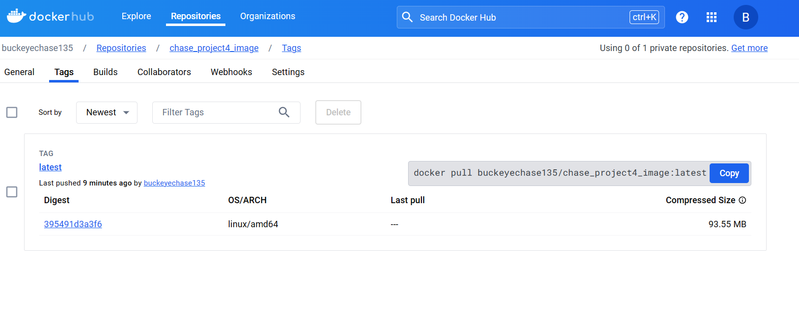
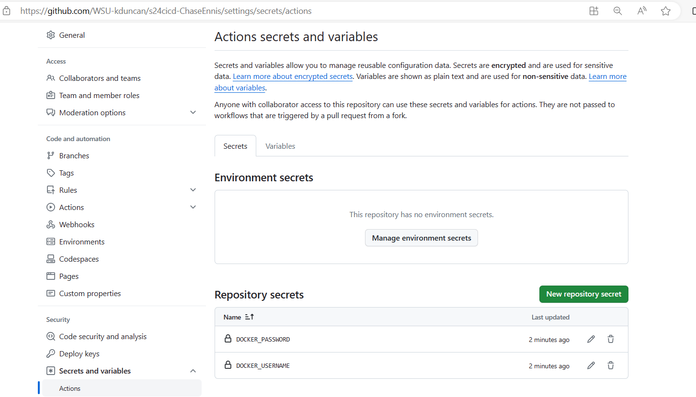

# Project 4: Introduction to the Design of Information Technology Systems - CEG3120

## Name: Chase Ennis     

### Part 1 - Dockerize It

1. Installing `docker`:
   * `sudo apt update`
   * `sudo apt install -y apt-transport-https ca-certificates curl software-properties-common`
   * `curl -fsSL https://download.docker.com/linux/ubuntu/gpg | sudo apt-key add -`
   * `sudo add-apt-repository "deb [arch=amd64] https://download.docker.com/linux/ubuntu $(lsb_release -cs) stable"`
   * `sudo apt update`
   * `sudo apt install docker-ce`
   * `sudo systemctl start docker`
   * `sudo systemctl enable docker`
   * `sudo usermod -aG docker $USER` (allows docker commands to be run without `root`)
   * 
   * [Containerize an Application](https://docs.docker.com/get-started/02_our_app/)
2. `docker` service commands:
   * `sudo systemctl start docker`: start docker
   * `sudo systemctl stop docker`: stop docker
   * `sudo systemctl status docker`: check docker status
   * `sudo docker ps -a`: lists all containers (running and stopped)
   * `docker images`: lists docker images
   * [Docker Commands Cheat Sheet](https://www.geeksforgeeks.org/docker-cheat-sheet/)
3. Configuring `Dockerfile`:
   * 
       * `FROM ubuntu:latest`: specifies the base image will be the most recent Ubuntu image
       * `RUN apt-get update && \ apt-get install -y apache2`: installs `apache2`
       * `COPY website/ /var/www/html/`: copies the website contents to the `apache2` hosting directory
       * `EXPOSE 80`: specifies docker listens on port 80 at runtime
       * `CMD ["apache2ctl", "-D", "FOREGROUND"]`: allows `apache2` http to run in the foreground which allows `docker` to run the container. If `apache2` the service was running, docker would be unable to also run on port 80 (see below)
4. Building Image and Running the Container
   * ` docker build -t chase_image -f /home/ubuntu/ceg3120/project4/Dockerfile /home/ubuntu/ceg3120/project4` (Builds the image)
      * 
   * `docker run -d -p 80:80 chase_image`
   * `docker run -d -p 8080:80 chase_image`
      * `-d` : detached mode which runs container in background
      * `-p 8080:80`: maps port `8080` on the host to port `80` inside the container
      * `chase_image`: name of the image
5. Proof
   * 
   * 
      * It is normal for the container IDs to be different. Every time the container is run, a new instance of that container is created
   * 
      * Because of `docker run -d -p 8080:80 chase_image` specifying `8080` works
   * 
      * Because of `docker run -d -p 80:80 chase_image` specifying `80` (http) works
   * Curling Private IP Address of the Container:
      * 
      * Note this image curls my site. My changes are further below, but this picture serves the purpose.
6. Issues
   * My biggest issue while setting this up was that I had `apache2` (the service) running on port 80, so then my container could not run on port 80. Once I grasped how this was actually working, it was understandable why.
   * When I stop my instance and restart it, I have to stop `apache2` the service (`sudo systemctl stop apache2`) and start the container (Ex: `docker start ce107b951017`)

### Part 2 - GitHub Actions and DockerHub

1. Create `DockerHub` Account
2. Create Public `DockerHub` Repository
   * Option that says `Create Repository`
   * Mine is called `chase_project4_image`
3. Authenticate into `DockerHub` via command line
   * Command to do so is `docker login --username DOCKER_USERNAME --password DOCKER_PASSWORD`
   * 
   * Obviously I covered my password up
4. Pushing to `DockerHub` without GitHub Actions
   * `docker tag chase_image buckeyechase135/chase_project4_image:latest`
      * creates a new tag for `chase_image` with the repository name `buckeyechase135/chase_project4_image` and the tag `latest`
      * effectively creates an alias for `chase_ennis` to refer to it as `buckeyechase135/chase_project4_image:latest`
   * `docker push buckeyechase135/chase_project4_image:latest`
      * pushes the image to `DockerHub`
   * 
   * 
   * [Link to My Repository](https://hub.docker.com/r/buckeyechase135/chase_project4_image)
5. Setting Up GitHub Secrets
   * Go to `Settings` ... `Secrets and Variables` ... `Actions` ... Under `Repository Secrets` click `New Repository Secret`
   * The secrets are the username and password for `DockerHub` so that I can set up my workflow (see below) between `GitHub` and `DockerHub`. These are the two fields that are needed to sign into the account. Adding these as repository secrets allows me to automate the building and pushing process.
   * 
6. Setting Up GitHub Workflow
   * On GitHub Browser inside my repository ... `Actions` ... `Set Up a Workflow Yourself` ... this will take my to a hidden repository called `.github/workflows` and let me start editing a file named `main.yml`.
   * Add the following contents:
  ```
    name: Build and Push Docker chase_project4_image
    
    on:
      push:
        branches:
          - main
    
    jobs:
      build:
        runs-on: ubuntu-latest
    
        steps:
          - name: Checkout code
            uses: actions/checkout@v2
    
          - name: Login to DockerHub
            uses: docker/login-action@v2
            with:
              username: ${{ secrets.DOCKER_USERNAME }}
              password: ${{ secrets.DOCKER_PASSWORD }}
    
          - name: Build Docker image
            run: docker build -t buckeyechase135/chase_project4_image:latest .
    
          - name: Push Docker image
            run: docker push buckeyechase135/chase_project4_image:latest

   ```
7. Testing
     * To test that this works I made changes to my file, set up a commit, and pushed. Then I went to `GitHub` browser and went to `Actions` and there was a yellow circle swirling letting me know that something was in progress. After a few seconds, it turned green. I went into `DockerHub` and my repository had been updated despite the fact that I had not made any changes to my image.
     * Everytime I make a change, this action file executes and my image is run again. This is why it is still run even if the changes do not directly involve the image.
8. Summary
    * The `DOCKER_USERNAME` and `DOCKER_PASSWORD` variables are local to my project. No one else shares my username and password so they would have to customize those secrets on their own account so that the `main.yml` file would work to their environment.
    * Obviously the repository names and the tags inside this file would need to be changed if this were to be reused.
    * In Summary, this pretty much makes `GitHub` commit my image again every time I make a commit to my repository.
9. Resources:
   * [Introduction to GitHub Actions](https://docs.docker.com/build/ci/github-actions/)
   * [Build and Push Docker Images](https://github.com/marketplace/actions/build-and-push-docker-images)


