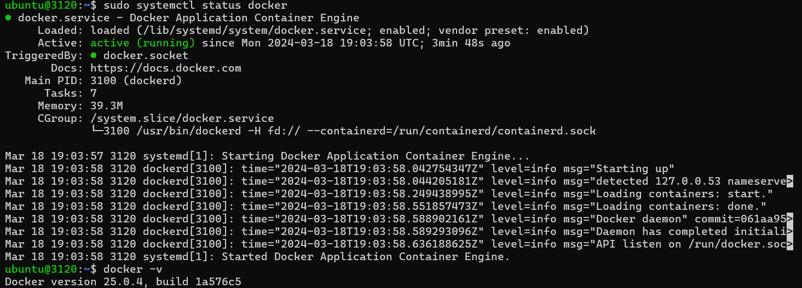
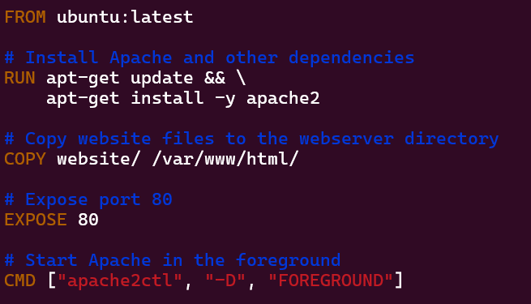
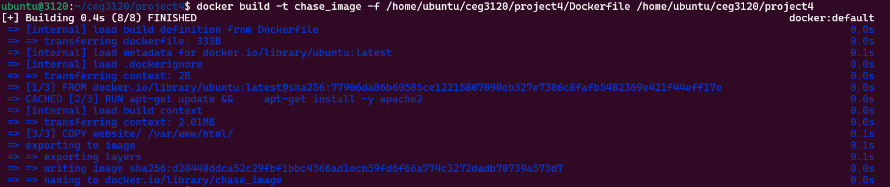
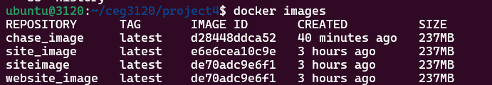
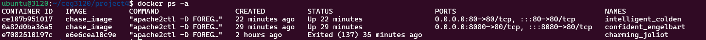
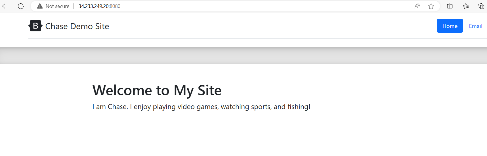
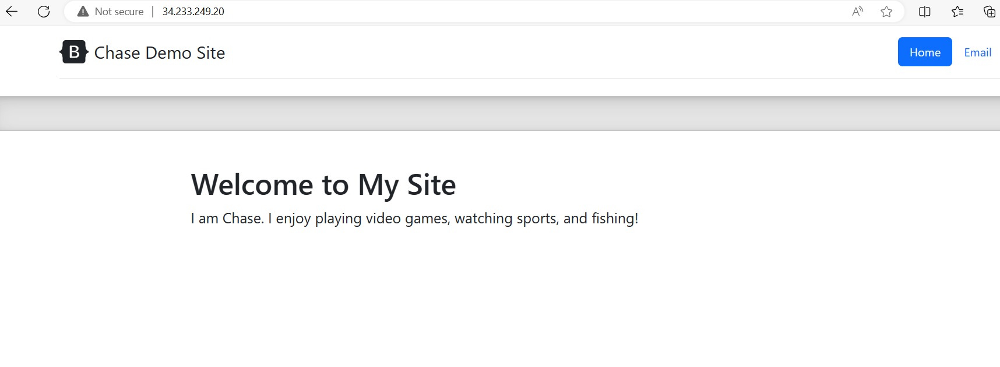
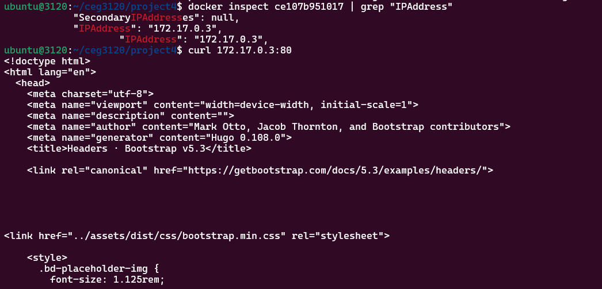

# Project 4: Introduction to the Design of Information Technology Systems - CEG3120

## Name: Chase Ennis  

### Part 1

> This part of the lab, I create a `docker` container to host and run the contents of my site

1. Installing `docker`:
   * `sudo apt update`
   * `sudo apt install -y apt-transport-https ca-certificates curl software-properties-common`
   * `curl -fsSL https://download.docker.com/linux/ubuntu/gpg | sudo apt-key add -`
   * `sudo add-apt-repository "deb [arch=amd64] https://download.docker.com/linux/ubuntu $(lsb_release -cs) stable"`
   * `sudo apt update`
   * `sudo apt install docker-ce`
   * `sudo systemctl start docker`
   * `sudo systemctl enable docker`
   * `sudo usermod -aG docker $USER` (allows docker commands to be run without `root`)
   * 
   * [Containerize an Application](https://docs.docker.com/get-started/02_our_app/)
2. `docker` service commands:
   * `sudo systemctl start docker`: start docker
   * `sudo systemctl stop docker`: stop docker
   * `sudo systemctl status docker`: check docker status
   * `sudo docker ps -a`: lists all containers (running and stopped)
   * `docker images`: lists docker images
   * [Docker Commands Cheat Sheet](https://www.geeksforgeeks.org/docker-cheat-sheet/)
3. Configuring `Dockerfile`:
   * 
       * `FROM ubuntu:latest`: specifies the base image will be the most recent Ubuntu image
       * `RUN apt-get update && \ apt-get install -y apache2`: installs `apache2`
       * `COPY website/ /var/www/html/`: copies the website contents to the `apache2` hosting directory
       * `EXPOSE 80`: specifies docker listens on port 80 at runtime
       * `CMD ["apache2ctl", "-D", "FOREGROUND"]`: allows `apache2` http to run in the foreground which allows `docker` to run the container. If `apache2` the service was running, docker would be unable to also run on port 80 (see below)
4. Building Image and Running the Container
   * ` docker build -t chase_image -f /home/ubuntu/ceg3120/project4/Dockerfile /home/ubuntu/ceg3120/project4` (Builds the image)
      * 
   * `docker run -d -p 80:80 chase_image`
   * `docker run -d -p 8080:80 chase_image`
      * `-d` : detached mode which runs container in background
      * `-p 8080:80`: maps port `8080` on the host to port `80` inside the container
      * `chase_image`: name of the image
5. Proof
   * 
   * 
      * It is normal for the container IDs to be different. Every time the container is run, a new instance of that container is created
   * 
      * Because of `docker run -d -p 8080:80 chase_image` specifying `8080` works
   * 
      * Because of `docker run -d -p 80:80 chase_image` specifying `80` (http) works
   * Curling Private IP Address of the Container:
      * 
      * Note this image curls my site. My changes are further below, but this picture serves the purpose.
6. Issues
   * My biggest issue while setting this up was that I had `apache2` (the service) running on port 80, so then my container could not run on port 80. Once I grasped how this was actually working, it was understandable why.

    

