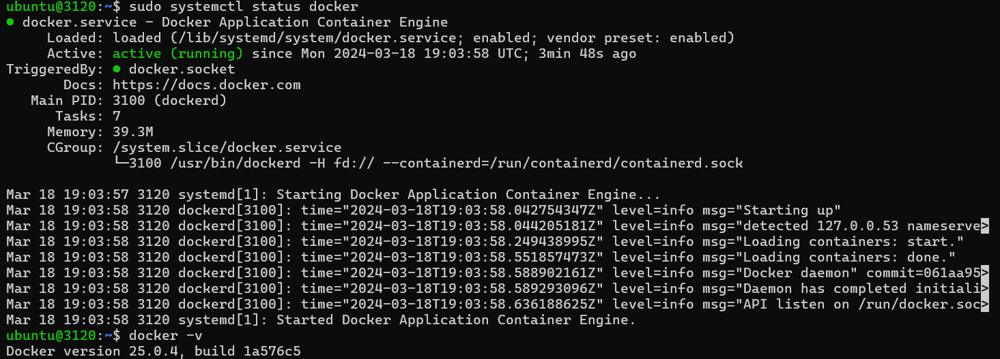
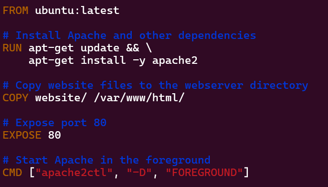
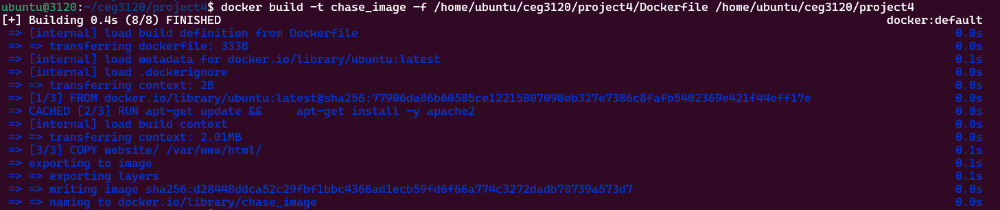
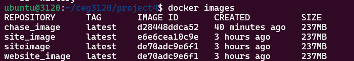
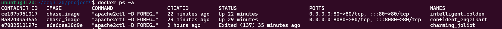
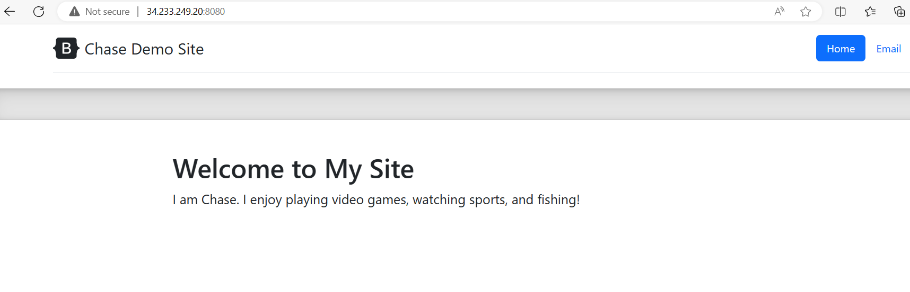
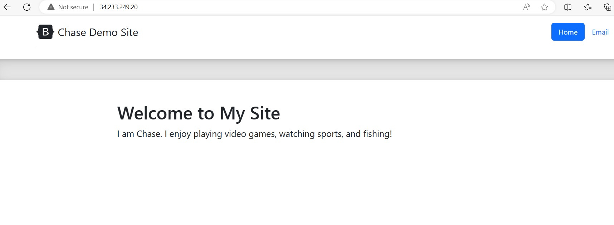

# Project 4: Introduction to the Design of Information Technology Systems - CEG3120

## Name: Chase Ennis  

### Part 1

1. Installing `docker`:
   * `sudo apt update`
   * `sudo apt install -y apt-transport-https ca-certificates curl software-properties-common`
   * `curl -fsSL https://download.docker.com/linux/ubuntu/gpg | sudo apt-key add -`
   * `sudo add-apt-repository "deb [arch=amd64] https://download.docker.com/linux/ubuntu $(lsb_release -cs) stable"`
   * `sudo apt update`
   * `sudo apt install docker-ce`
   * `sudo systemctl start docker`
   * `sudo systemctl enable docker`
   * sudo usermod -aG docker $USER (allows docker commands to be run without `root`
   * 
   * [Containerize an Application](https://docs.docker.com/get-started/02_our_app/)
2. Configuring `Dockerfile`:
   * 
3. Building Image and Running the Container
   * ` docker build -t chase_image -f /home/ubuntu/ceg3120/project4/Dockerfile /home/ubuntu/ceg3120/project4` (Builds the image)
      * 
   * `docker run -d -p 80:80 chase_image`
   * `docker run -d -p 8080:80 chase_image`
      * `-d` : detached mode which runs container in background
      * `-p 8080:80`: maps port `8080` on the host to port `80` inside the container
      * `chase_image`: name of the image
4. Proof
   * 
   * 
      * It is normal for the container IDs to be different. Every time the container is run, a new instance of that container is created
   * 
      * Because of `docker run -d -p 8080:80 chase_image` specifying `8080` works
   * 
      * Because of `docker run -d -p 80:80 chase_image` specifying `80` (http) works
   * Curling Private IP Address of the Container:
      * 
5. Issues
   * My biggest issue while setting this up was that I had `apache2` (the service) running on port 80, so then my container could not run on port 80. Once I grasped how this was actually working, it was understandable why.

    

